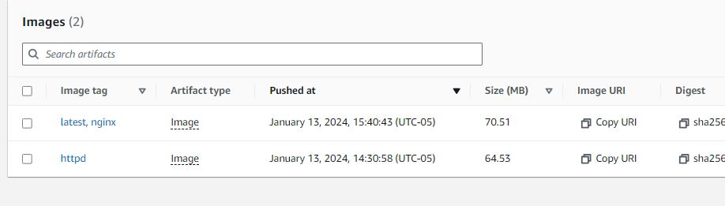
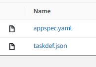
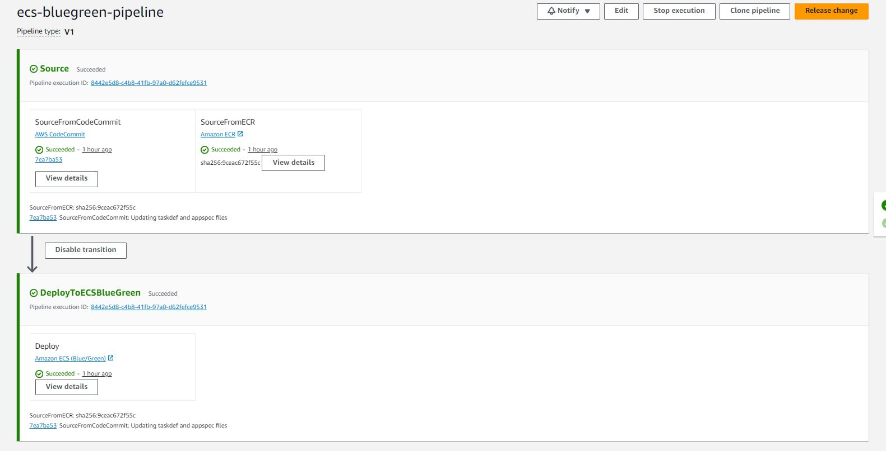
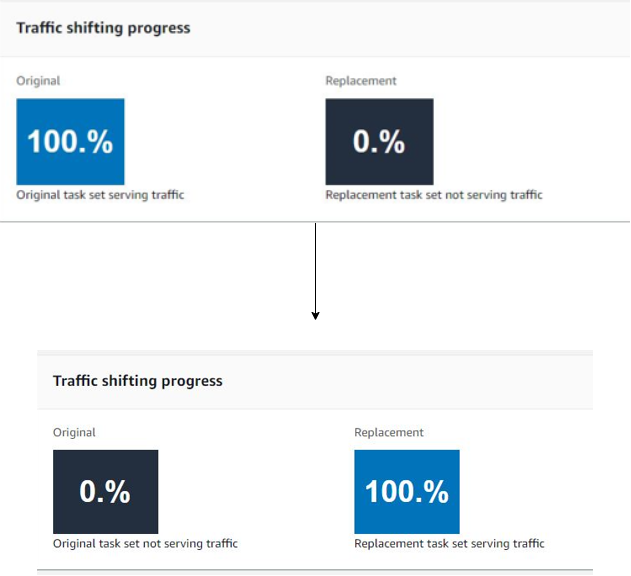
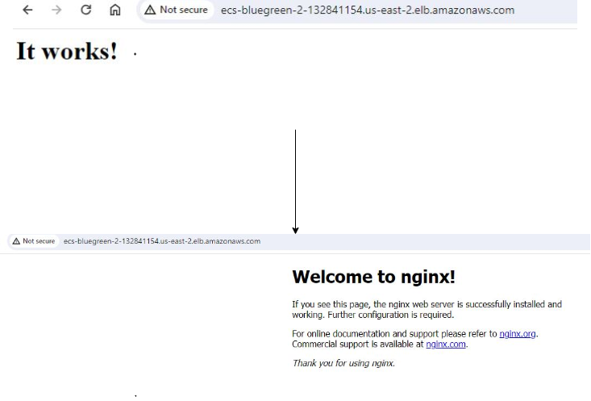

# Create an ECS Blue-Green deployment

This project implements the instructions provided on  [AWS Create Pipeline for ECR to ECS Deployment](https://docs.aws.amazon.com/codepipeline/latest/userguide/tutorials-ecs-ecr-codedeploy.html) into terraform code for blue green deployments. Eventually a pipeline that can perform a Blue-Green deployment of an ECS Cluster is created. Its is assumed that you have a VPC setup or use the default VPC with public subnets


### Following resources were created by terraform 

#### CICD Infrastructure
 1. S3 Buckets for Deployment
 2. IAM Roles
 3. Code Commit
 4. Code Deploy
 5. Code Pipeline
 6. ECR Repo's
 7. S3 Buckets for backend Terraform state

#### Application Infrastructure
 1. Load balancers, target groups, listeners
 2. ECS Task, Service and Cluster 
 3. ECR Repo
 4. Related IAM Roles

### IaC tools
Terraform was used to create all resources. Two options are provided
-  Create local Terraform Backend
-  Create remote Terraform Backend State in S3

## Folder Structure

```
└───ecs-bluegreen-deployment
    ├───documents
    │   └───images
    └───resource-creation
        ├───docker
        └───tf
            ├───backend-s3-tf
            │   └───modules
            │       └───terraform-backend
            ├───ecs-bg-ecr-pre-req-1
            ├───ecs-bg-with-s3-backend-tf
            └───ecs-bg-wo-s3-backend-tf

```

#### Deployment instructions

Following instructions assume S3 Backend is being used. This can be avoided by removing the main.tf file where mentioned.

1. <b>Create Terrraform Backend"</b> Go to folder - [backend-s3-tf](resource-creation/tf/backend-s3-tf)

```
cd resource-creation/tf/backend-s3-tf

## Edit terraform.tfvars with appropriate values

## run standard terraform commands
terraform init
terraform plan
terraform apply -auto-approve

## Capture the output values. Copy the S3 bucket name that is printed out


```

2. <b> Create the ECR Repo</b> Go to folder - [ecs-bg-ecr-pre-req-1](resource-creation/tf/ecs-bg-ecr-pre-req-1)


```
cd resource-creation/tf/ecs-bg-ecr-pre-req-1

## Existing folder structure creates a backend S3 terraform state. If you do not want a remote state file then remove main.tf
## Edit terraform.tfvars with appropriate values

## run standard terraform commands
terraform init
terraform plan
terraform apply -auto-approve

## Go to ECR Service page on AWS Console page and verify the repo is created- you will need to copy push commands


```

3. <b>Create Docker Images</b> Go to folder - [docker](resource-creation/docker) <br>

There are two Dockerfiles. For simplicity one is a basic Nginx webserver and the other is Apache (httpd) webserver.
For this we first deploy the httpd docker image through ECS. The Blue green deployment replaces it with the nginx image. Detailed instructions to push the images to ECR are available on [AWS ECR userguide](https://docs.aws.amazon.com/AmazonECR/latest/userguide/docker-push-ecr-image.html). You can also obtain the commands from ECR page by clicking the [View push commands button](documents/images/Get-PushCommandsFrom-ECR.JPG)


The commands are generally in the format shown below. The name of container and ECR repo (repo name is ecs-bluegreen here) should match (as of January 2024)

```
## Dockerfile

#### choose your docker file, here HTTPD is deployed first
cp Dockerfile.httpd Dockerfile

aws ecr get-login-password --region us-east-1 | docker login --username AWS --password-stdin ${AccId}.dkr.ecr.{region}.amazonaws.com
docker build -t ecs-bluegreen .
docker tag ecs-bluegreen:latest ${AccId}.dkr.ecr.{region}.amazonaws.com/ecs-bluegreen:latest
docker push  ${AccId}.dkr.ecr.{region}.amazonaws.com/ecs-bluegreen:latest

## You can add extra tags -- suchaas httpd or ngnix or any other identifier- example below
docker tag ${AccId}.dkr.ecr.{region}.amazonaws.com/ecs-bluegreen:latest ${AccId}.dkr.ecr.{region}.amazonaws.com/ecs-bluegreen:httpd
docker push ${AccId}.dkr.ecr.{region}.amazonaws.com/ecs-bluegreen:httpd

```

4. <b>Create All Resources</b> Go to folder - [ecs-bg-with-s3-backend-tf](resource-creation/tf/ecs-bg-with-s3-backend-tf). Edit the terraform.tfvars file as needed

```
cd resource-creation/tf/ecs-bg-ecr-pre-req-1

## Existing folder structure creates a backend S3 terraform state. If you do not want a remote state file then remove main.tf as in the folder resource-creation/tf/ecs-bg-wo-s3-backend-tf 
## Edit terraform.tfvars with appropriate values

## run standard terraform commands
terraform init
terraform plan
terraform apply -auto-approve

## Check if code pipeline has been created

```
5. <b> Update the image in the ECR Repo </b> - Repeat the docker container creation steps with a different doccker file. In this case we have httpd vs nginix

```
cp Dockerfile.nginx Dockerfile
nginx
aws ecr get-login-password --region us-east-1 | docker login --username AWS --password-stdin ${AccId}.dkr.ecr.{region}.amazonaws.com
docker build -t ecs-bluegreen .
docker tag ecs-bluegreen:latest ${AccId}.dkr.ecr.{region}.amazonaws.com/ecs-bluegreen:latest
docker push  ${AccId}.dkr.ecr.{region}.amazonaws.com/ecs-bluegreen:latest

## You can add extra tags -- such as httpd or ngnix or any other identifier- example below
docker tag ${AccId}.dkr.ecr.{region}.amazonaws.com/ecs-bluegreen:latest ${AccId}.dkr.ecr.{region}.amazonaws.com/ecs-bluegreen:nginx
docker push ${AccId}.dkr.ecr.{region}.amazonaws.com/ecs-bluegreen:nginx

```


The ECR Repo should appear as follows. <br>



6. Push files taskdef.json and appspec.json to the Codecommit repo created earlier (Step-4). Refer [AWS Documentation](https://docs.aws.amazon.com/codepipeline/latest/userguide/tutorials-ecs-ecr-codedeploy.html#tutorials-ecs-ecr-codedeploy-deployment) for further details.

Instructions for commiting code to AWS Code Commit are available [here](https://docs.aws.amazon.com/codecommit/latest/userguide/setting-up-ssh-unixes.html) and this can be performed in multiple ways. Eventually only two files need to be uploaded as shown below <br> 


7. <b> Release Change in the Code Pipeline </b> Release the change in the code pipeline. The final product should appear as shopwn below.

  -  <b> The CodePipeline </b>  <br> 

  -  <b>The Blue to Green Transition</b> <br> 

  -  <b>Apache to NGINX transition</b> <br> 

#### Contact
In case of any questions, concerns, suggestions or critiques, please contact email me at kloudexplorer@gmail.com.


